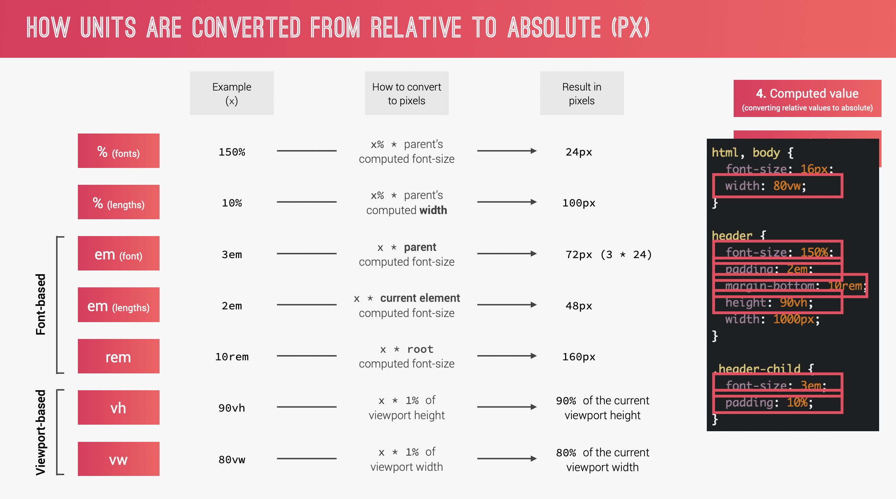

# NOTES for Advanced css course on udemy

## SECTION 2 Setting up Natours project and first steps

## 6. building the header part 1

learned new css property which is `clip-path`. as a value it can accept some built in funcs such as `polygon()`. there is a resource that i can use to plot the point visually instead of trying to find out in my mind. resource: bennettfeely.com/clippy

## 7. building the header part 2

new discovery: img tags are inline! but they behave more like inline-block in regards to width and height. an answer that i found on SO states like this:

```js
img elements are inline, meaning that unless they are floated they will flow horizontally with text and other inline elements.

they are "block" elements in that they have a width and a height. but they behave more like "inline-block" in that respect.
```

and as Jonas states it's better to place img inside a div container and style that div to make it easier to handle imgs tags

when specifying width or height of an img, we just need to give only one (width or height) the other one is automatically figured out by the browser. so if we specify height with a certain unit, its width is figured out by the browser

## 10. building complex animation on button part 2

new css property learned. `animation-fill-mode`. the value for this property is which we used `backwards`. what this css prop does is to determine what before and after state is for the animation execution

## SECTION 3 How css works. a look behind the scenes

## 12. three pillars of writing good html and css

**1. Responsive Design** is standard already. it inlcudes fluid layouts, media queries, responsive images, correct units and desktop-first vs mobile-first aspects. i believe they are crystal clear for me as i have already learned about them in intermediate css course by Jonas

**2. Maintainable and scalable code** is more for Dev than end user. it includes clean code, easy-to understand code, code growth, reusable code, how to organise files, how to name classes, how to structure html aspects

**3. Web Performance** means making the website to load faster and smaller size. to achieve this we can also do below things: make fewer http requests, less code, compressing code, using css preprocessor, fewer images or smaller size images, compressing images

## 14. how css is parsed. cascading and specificity

cascade is process of combining different stylesheets and resolving conflicts between different css rules and declarations, when more than one rule applies to a certain element

well this is new to me. there are 3 types of css. author css is the one that developers write. there is also the one called user css which is when user changes default font size on the browser. and the last one is browser (user agent) css which is that ambigious default css that we most of the time just nullify (reset)

so how does css resolve this conflicting css's. to determine the precedence order of the css, these are taken into account => importance (weight) > specificity > source order

### Importance

1. User `!important` declarations
2. Author `!important` decalations
3. Author declarations
4. User declarations
5. Default browser declarations

### Specificity order from highest to lowest

1. Inline styles - highest specificity
2. IDs
3. Classes, pseudo-classes, attribute
4. Elements, pseudo-elements

when calculating specificity the resulting value that wins is called cascading value

### Source order

when there are css rules with the same specificity, the declaration that comes last on the css file will be used

gotcha: universal selector \* has no specificity value (0, 0, 0, 0)

tip: rely more on specificity than on the order of selectors. that way when you rearrange css code, the specificity stays the same

## 16. how css is parsed. value processing

- in css every unit is converted to pixels. there are many measuring units such as rem, em, percentages, viewport and pixels. if we use anything other than pixels it will eventually be computed to pixels. however there are a set of steps and rules for processing different units. so this chapter is about that

starting from the declared value up until final actual value there are 6 steps that css goes through

let's try to dissect each step using this image:

1. **Declared value** is simply the code that we wrote. in the image there are 2 instances where css style with measure is given. one is in percentage and the other is in pixels
2. **Cascaded value** is the one chosen after cascading rules are applied. in this case it's the percentage value that is chosen
3. **Specified value** is a default value of certain css property. since we already have value in our example this step is simply skipped.
4. **Computed value** is the step which converts relative values such as auto, orange etc. is computed to absolute values. in our example since what we got is not that type of value so we just skip this process as well
5. **Used value** is the final calculation result value in a unit that browser uses which is pixels. this value is derived from all those steps above and calculated to pixels in our case it was percentage and now it's 184.8px. this happens in rendering phase
6. **Actual value** is the actual value to be used. in our case the value is rounded to the value that browser can use

More on the number 3 which is Specified value. All elements attributes have their initial value. Even if we don't specify them their values are given based on that specified value. it's usually 0

_rem_ and _em_ are not absolute values but rather relative values. that's why they are processed in step 4

- **to convert units from relative to absolute** css performs a set of steps. that's step 4 and 5 from above steps

let's try to dissect just like we did above 

one thing to note is that units are things like percentages, em, rem, vh and vw. they are all units. they need to be converted to pixels.
however, they are treated differently based on what they represent. there are two types which are units for font sizes and for length(distance) sizes.

There is difference in percentages used for fonts and lengths. when percentage is used for an element's font size that percentage is derived from parent elements font size. in our case from the image, it's the body and html that is parent for header tag. but when it's for length, it's parent element's width that is used to derive the elements length unit(although there is a catch! it doesn't work for all elements and there exist some exceptions. ex: line-height. the rule for it is the same as percentage used for fonts. it uses parent's font size to derive the value). in our case, .header-child has padding of 10% and that means parent element has width of 1000px which makes padding of 10% equal to 100px. please note that this is for percentage based calcs

em for fonts and em for length also differs. em for fonts uses parent elements font size as a reference while em for lengths uses current element's font size as a reference. I know that's kinda weird when length based em references current element's font size as a reference. there is double excl mark right here.
rem always uses root element as a reference

vh and vw is simple. 1vh is 1% of the viewport. same for vw

below is the wrap up points for the new things i learned [image3](./notes-assets/key-points-for-units.png)

## 19. how css renders a website

there are lots of things talked here most of which I already know. but this might need coming back and reviewing it in the future if needed.
